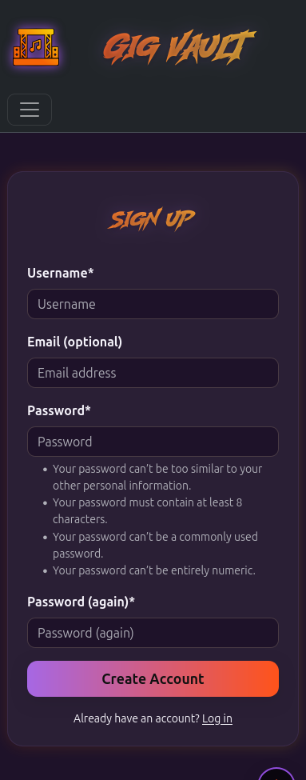

# Testing

> [!NOTE]  
> Return back to the [README.md](README.md) file.

## Code Validation

### HTML

I have used the recommended [HTML W3C Validator](https://validator.w3.org) to validate my HTML files.

| Directory | File | URL | Screenshot |
| --- | --- | --- | --- |
| gigs | [band_form.html](https://github.com/runwiththerhythm/gig_vault/blob/main/gigs/templates/gigs/band_form.html) | ⚠️ Link (if applicable) |  |
| gigs | [dashboard.html](https://github.com/runwiththerhythm/gig_vault/blob/main/gigs/templates/gigs/dashboard.html) | ⚠️ Link (if applicable) |  |
| gigs | [dashboard_base.html](https://github.com/runwiththerhythm/gig_vault/blob/main/gigs/templates/gigs/dashboard_base.html) | ⚠️ Link (if applicable) |  |
| gigs | [gig_confirm_delete.html](https://github.com/runwiththerhythm/gig_vault/blob/main/gigs/templates/gigs/gig_confirm_delete.html) | ⚠️ Link (if applicable) |  |
| gigs | [gig_detail.html](https://github.com/runwiththerhythm/gig_vault/blob/main/gigs/templates/gigs/gig_detail.html) | ⚠️ Link (if applicable) |  |
| gigs | [gig_form.html](https://github.com/runwiththerhythm/gig_vault/blob/main/gigs/templates/gigs/gig_form.html) | ⚠️ Link (if applicable) |  |
| gigs | [my_gigs.html](https://github.com/runwiththerhythm/gig_vault/blob/main/gigs/templates/gigs/my_gigs.html) | ⚠️ Link (if applicable) |  |
| templates | [home.html](https://github.com/runwiththerhythm/gig_vault/blob/main/templates/home.html) | ⚠️ Link (if applicable) |  |
| templates | [login.html](https://github.com/runwiththerhythm/gig_vault/blob/main/templates/account/login.html) | ⚠️ Link (if applicable) |  |
| templates | [logout.html](https://github.com/runwiththerhythm/gig_vault/blob/main/templates/account/logout.html) | ⚠️ Link (if applicable) |  |
| templates | [password_reset.html](https://github.com/runwiththerhythm/gig_vault/blob/main/templates/account/password_reset.html) | ⚠️ Link (if applicable) |  |
| templates | [signup.html](https://github.com/runwiththerhythm/gig_vault/blob/main/templates/account/signup.html) | ⚠️ Link (if applicable) |  |

### CSS

I have used the recommended [CSS Jigsaw Validator](https://jigsaw.w3.org/css-validator) to validate all of my CSS files.
| Directory | File | URL | Screenshot |
| --- | --- | --- | --- |
| gigvault | [gigvault.css](https://github.com/runwiththerhythm/gig_vault/blob/main/static/css/gigvault.css) | [CSS W3C Validator](https://jigsaw.w3.org/css-validator/validator?uri=https://gig-vault-2fe6800a7bea.herokuapp.com) |  | 

### JavaScript

I have used the recommended [JShint Validator](https://jshint.com) to validate all of my JS files.

| Directory | File | URL | Screenshot |
| --- | --- | --- | --- |
| gigvault | [image-previews.js](https://github.com/runwiththerhythm/gig_vault/blob/main/static/js/image-previews.js) | [JSHint.com](https://https://jshint.com/) |  | 
| gigvault | [theme-toggle.js](https://github.com/runwiththerhythm/gig_vault/blob/main/static/js/theme-toggle.js) | [JSHint.com](https://https://jshint.com/) |  | 

### Python

I have used the recommended [PEP8 CI Python Linter](https://pep8ci.herokuapp.com) to validate all of my Python files.

| Directory | File | URL | Screenshot | 
| --- | --- | --- | --- |
|  | [dedupe_bands_fixture.py](https://github.com/runwiththerhythm/gig_vault/blob/main/dedupe_bands_fixture.py) | [PEP8 CI Link](https://pep8ci.herokuapp.com/https://raw.githubusercontent.com/runwiththerhythm/gig_vault/main/dedupe_bands_fixture.py) |  |
| gigs | [admin.py](https://github.com/runwiththerhythm/gig_vault/blob/main/gigs/admin.py) | [PEP8 CI Link](https://pep8ci.herokuapp.com/https://raw.githubusercontent.com/runwiththerhythm/gig_vault/main/gigs/admin.py) |  |
| gigs | [forms.py](https://github.com/runwiththerhythm/gig_vault/blob/main/gigs/forms.py) | [PEP8 CI Link](https://pep8ci.herokuapp.com/https://raw.githubusercontent.com/runwiththerhythm/gig_vault/main/gigs/forms.py) |  |
| gigs | [models.py](https://github.com/runwiththerhythm/gig_vault/blob/main/gigs/models.py) | [PEP8 CI Link](https://pep8ci.herokuapp.com/https://raw.githubusercontent.com/runwiththerhythm/gig_vault/main/gigs/models.py) |  |
| gigs | [tests.py](https://github.com/runwiththerhythm/gig_vault/blob/main/gigs/tests.py) | [PEP8 CI Link](https://pep8ci.herokuapp.com/https://raw.githubusercontent.com/runwiththerhythm/gig_vault/main/gigs/tests.py) |  |
| gigs | [urls.py](https://github.com/runwiththerhythm/gig_vault/blob/main/gigs/urls.py) | [PEP8 CI Link](https://pep8ci.herokuapp.com/https://raw.githubusercontent.com/runwiththerhythm/gig_vault/main/gigs/urls.py) |  |
| gigs | [views.py](https://github.com/runwiththerhythm/gig_vault/blob/main/gigs/views.py) | [PEP8 CI Link](https://pep8ci.herokuapp.com/https://raw.githubusercontent.com/runwiththerhythm/gig_vault/main/gigs/views.py) |  |
| gigvault | [settings.py](https://github.com/runwiththerhythm/gig_vault/blob/main/gigvault/settings.py) | [PEP8 CI Link](https://pep8ci.herokuapp.com/https://raw.githubusercontent.com/runwiththerhythm/gig_vault/main/gigvault/settings.py) |  |
| gigvault | [urls.py](https://github.com/runwiththerhythm/gig_vault/blob/main/gigvault/urls.py) | [PEP8 CI Link](https://pep8ci.herokuapp.com/https://raw.githubusercontent.com/runwiththerhythm/gig_vault/main/gigvault/urls.py) |  |
| gigvault | [views.py](https://github.com/runwiththerhythm/gig_vault/blob/main/gigvault/views.py) | [PEP8 CI Link](https://pep8ci.herokuapp.com/https://raw.githubusercontent.com/runwiththerhythm/gig_vault/main/gigvault/views.py) |  |
|  | [manage.py](https://github.com/runwiththerhythm/gig_vault/blob/main/manage.py) | [PEP8 CI Link](https://pep8ci.herokuapp.com/https://raw.githubusercontent.com/runwiththerhythm/gig_vault/main/manage.py) |  |

## Responsiveness

I've tested my deployed project to check for responsiveness issues.

| Page | Mobile | Tablet | Desktop | Notes |
| --- | --- | --- | --- | --- |
| Register |  |  |  | Works as expected |
| Login |  |  |  | Works as expected |
| Home |  |  |  | Works as expected |
| Add Gig |  |  |  | Works as expected |
| Edit Gig |  |  |  | Works as expected |
| About |  |  |  | Works as expected |
| 404 |  |  |  | Works as expected |

## Browser Compatibility

I've tested my deployed project on multiple browsers to check for compatibility issues.

Browsers used for testing:
- [Chrome](https://www.google.com/chrome)
- [Firefox (Developer Edition)](https://www.mozilla.org/firefox/developer)
- [Brave](https://brave.com/download)

| Page | Chrome | Firefox | Brave | Notes |
| --- | --- | --- | --- | --- |
| Register |  |  |  | Works as expected |
| Login |  |  |  | Works as expected |
| Home |  |  |  | Works as expected |
| Add Gig |  |  |  | Works as expected |
| Edit Gig |  |  |  | Works as expected |
| About |  |  |  | Works as expected |
| 404 |  |  |  | Works as expected |

## Lighthouse Audit

I've tested my deployed project using the Lighthouse Audit tool to check for any major issues. Mobile results are expected to be lower than desktop.

| Page | Mobile | Desktop |
| --- | --- | --- |
| Register |  |  |
| Login |  |  |
| Home |  |  |
| About |  |  |
| 404 |  |  |

## Defensive Programming & Manual Testing

Defensive programming was manually tested with user acceptance testing across **Gig Vault’s** core features.  
Testing focused on authentication, form validation, CRUD functionality, and access restrictions.  
The goal was to ensure that users cannot manipulate data belonging to other accounts, brute-force URLs, or bypass restrictions.

| Page / Feature | Expectation | Test | Result |
| --- | --- | --- | --- |
| Gig Management         | Users can create a new gig with required fields (band, venue, date, etc.)   | Submitted gig creation form with valid data.                         | Gig was created successfully and displayed in the dashboard list.                           | 
|                        | Users cannot submit an empty gig form.                                      | Tried submitting with missing required fields.                       | Form validation prevented submission and displayed error messages.                          | 
|                        | Users can edit their own gigs but not others'.                              | Logged in as User A and attempted to edit User B’s gig.              | Access was denied; only the owner could edit their gig.                                      | 
|                        | Users can delete their own gigs after confirmation.                         | Deleted a gig via the dashboard.                                     | Gig was removed from the database and dashboard refreshed.                                   | 
| Image Uploads          | Users can upload multiple gig images (cover + gallery).                     | Uploaded multiple files using the image picker.                      | All images were stored; one cover image was set automatically.                              | 
| Authentication         | Only registered users can log in and access dashboard.                      | Attempted login with valid and invalid credentials.                   | Valid credentials allowed access; invalid credentials rejected with error message.           | 
|                        | Logged-out users cannot access dashboard pages.                             | Logged out and tried accessing `/dashboard/gigs/`.                   | Redirected to login page as expected.                                                        | 
| Access Control         | User A should not access User B’s gigs.                                     | Navigated manually to another user’s gig detail via URL manipulation. | Access was denied (404/redirect).                                                           | 
|                        | Non-superusers should not access admin pages.                               | Attempted to access `/admin/` as a standard user.                    | Access blocked; redirected to login/denied access page.                                      | 
| Venue Search           | Venue autocomplete must store text fields only (no lat/long).               | Submitted form with Mapbox venue search.                             | Venue details saved correctly as text fields (`venue_name`, `venue_city`, `venue_country`). | screenshot |
| 404 Error Page         | Invalid URLs should return a custom 404 error page.                         | Navigated to `/test123`.                                             | Custom 404 page displayed with styled Gig Vault messaging.                                   |

## User Story Testing

| Target | Expectation | Outcome | Screenshot |
| --- | --- | --- | --- |
| As a first time visitor,|  I can view detailed information about the app without having to register, | so that I can decide if I want to use it. |  |
| As a first time visitor, | I would like to be able to navigate the site easily | so that I can find relevant information quickly. |   |
| As a new user | I can sign up easily using a registration form | so that I can create an account and start using the app. |   |
| As a registered user | I can log in securely | so that I can access my private dashboard and saved gigs.|   |
| As a user who forgot my password | I can reset it via email | so that I can regain access to my account. |   |
| As a logged in user,| I can log out, | so that I can end my session securely.|   |
| As a user,| I can view a friendly error page if I hit a dead link | so that I’m not confused or lost. |   |
| As a logged in user,| I want to add a gig I attended | so that I can manage user engagement effectively. |   |
| As a logged in user, | I want the band field to autocomplete when typing| so I don’t create duplicate entries. |   |
| As a logged in user, | I want to view the full details of a specific gig, | so I can revisit memories and see all the information I entered.|   |
| As a logged in user, | I want to edit an existing gig,  | so I can fix mistakes or update information like venue, date, or notes.|   |
| As a logged in user, |  I want to delete a gig, | so I can remove any accidental or unwanted entries.|   |
| As a logged in user, | I want to view a list of all gigs I’ve entered,| so I can browse my gig history easily.|   |
| As a logged in user, | I want to upload and manage images for a gig,| so I can visually document the concert experience.|   |
| As a logged in user, |I want to record a festival as a gig that contains multiple band performances, | so I can document the full experience in one place.|   |
| As a logged in user, | I want to add other artists who performed at the same gig,  | sso I can log the full lineup. |   |
| As a logged in user,| I want to see relevant YouTube videos from a gig,| so I can relive the performance without having to manually search. |   |

## Automated Testing

I have conducted a series of automated tests on my application.

> [!NOTE]  
> I fully acknowledge and understand that, in a real-world scenario, an extensive set of additional tests would be more comprehensive.

### Python (Unit Testing)

I used Django’s built-in unittest framework to test Gig Vault’s core functionality (models, views, and helpers). Tests live in gigs/tests.py.

Key tests currently included:

#### Models

Band: string representation.

Venue: string representation (field-agnostic to support either name/city/country or venue_name/venue_city/venue_country).

Gig: creation and other_artists (M2M) behavior.

GigVideo: URL validation via clean() and embed_url property.

GigImage: optional DB constraint test for single is_cover=True per gig (skips if constraint not present).

#### Views

my_gigs: authentication redirect + lists the user’s gigs.

gig_detail: renders and includes venue info.

#### Run the tests

From the project root (same folder as manage.py):
- `python manage.py test`

#### Unit Test Issues

Single cover image constraint

Issue: Wanted to enforce one is_cover=True per gig, but DB constraint wasn’t defined.

Fix: Test auto-skips if the named constraint (unique_cover_per_gig) isn’t found.

Summernote warning

Message: but css_sanitizer not set.

Status: Harmless; does not affect results. 

## Bugs

### Fixed Bugs

I've used [GitHub Issues](https://www.github.com/runwiththerhythm/gig_vault/issues) to track and manage bugs and issues during the development stages of my project.

All previously closed/fixed bugs can be tracked [here](https://www.github.com/runwiththerhythm/gig_vault/issues?q=is%3Aissue+is%3Aclosed+label%3Abug).

### Unfixed Bugs

Any remaining open issues can be tracked [here](https://www.github.com/runwiththerhythm/gig_vault/issues).

### Known Issues

> [!IMPORTANT]  
> Gig Vault has no remaining bugs that I am aware of, however even after thorough testing I cannot rule out the possibility.

